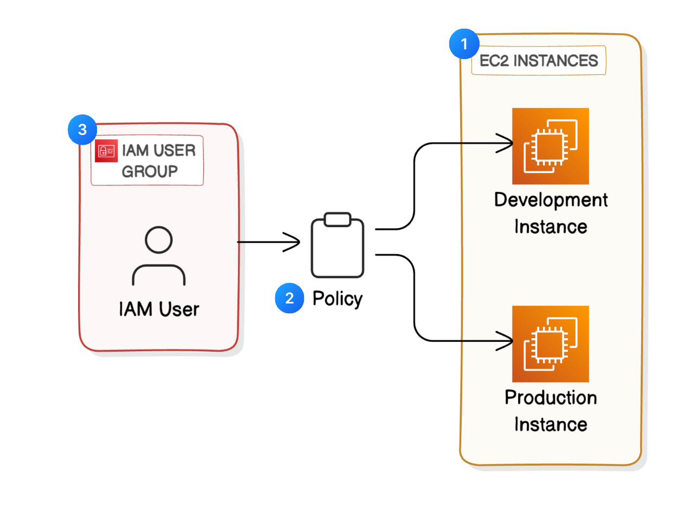

# 🔐 AWS Beginner Challenge - Day 3: Cloud Security with AWS IAM

This is my solution for Day 3 of the [NextWork AWS Challenge - Cloud Security with IAM.](https://learn.nextwork.org/projects/aws-security-iam)

## 🛠️ Steps I Followed:
1. Launched EC2 instances in different environments (development and production)
2. Used tags to distinguish environments for better management
3. Created IAM policies to control EC2 access based on environment tags
4. Created an IAM user and assigned them to an IAM group
5. Tested access permissions to ensure correct policy behavior

## 🧠 What I Learned:
- How to manage EC2 instances using IAM policies and tags 
- Creating custom IAM policies for specific roles and environments
- Importance of least privilege and role-based access control (RBAC)
- How IAM users and groups are managed securely in AWS
