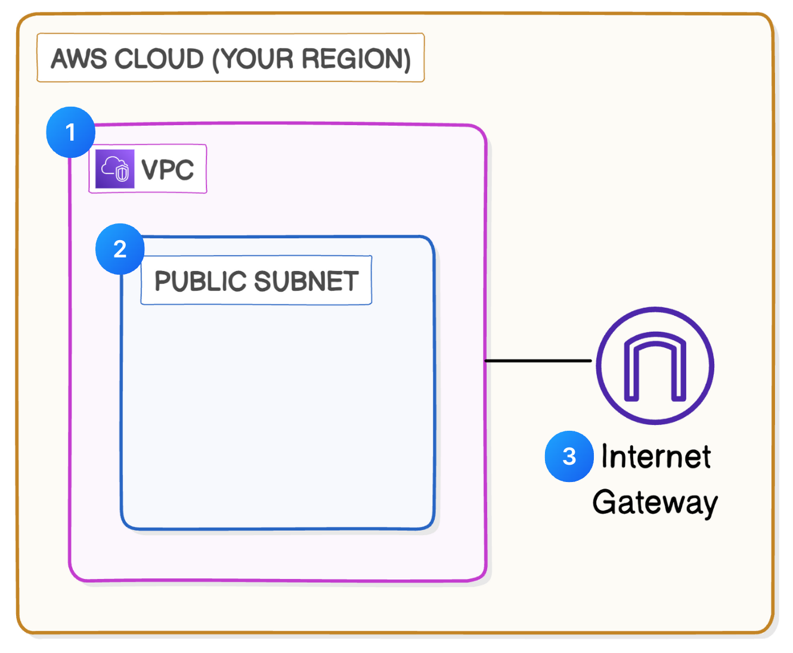

# 🌐 AWS VPC Setup Project

This project documents my hands-on learning experience with **Amazon VPC (Virtual Private Cloud)**.  
It covers the creation of a VPC, subnets, internet gateway, and basic networking setup.  

---

## 🏗️ Architecture Diagram

Here’s the architecture of what I built:

*(Save your diagram as `architecture.png` in your repo root for it to display here.)*

---

## 📘 What I Learned

### ☁️ Create a VPC
I created my first **Virtual Private Cloud (VPC)** using Amazon VPC.  
Think of it as my own private section of the AWS cloud.

### 🥅 Create Subnets
- Subnets are like neighborhoods inside the VPC.  
- I learned the difference between **public** and **private subnets**.  
- Configured a subnet to automatically assign **public IPs**, so instances can be accessible from the internet.

### 🚪 Set Up an Internet Gateway
- Added and attached an **Internet Gateway** to the VPC.  
- This acts as the “main gate” that lets data flow in and out of my VPC.  
- Configured routing so public instances can access the internet.

### 🚏 Bonus - Configure IP Addresses & CIDR Blocks
- Configured an **IPv4 CIDR block** for the VPC.  
- Learned that IP addresses work like street addresses for resources.  
- Explored how different **CIDR block sizes** define the scale of the VPC.

---

## 🔮 Next Steps
- Add **security groups** and **network ACLs** to control traffic.  
- Launch an **EC2 instance** inside the subnet.  
- Configure a **route table** for better traffic management.  

---

## 📌 Notes
This project is part of my AWS learning journey and guided by Nextwork Org. More cloud projects will be added here as I progress.

